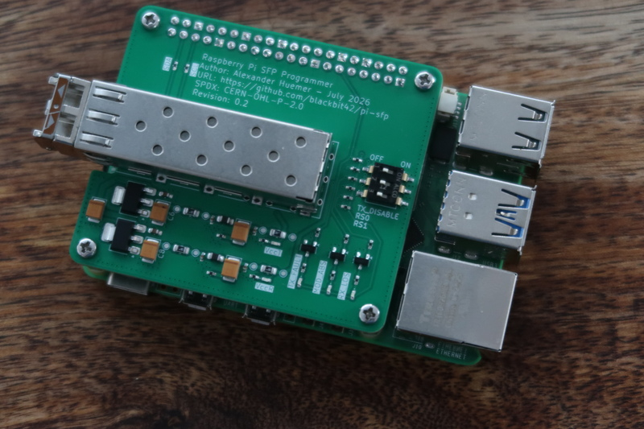

# Raspberry Pi SFP Programmer
This is a [KiCad](https://www.kicad.org/) PCB that makes a [Raspberry Pi](https://www.raspberrypi.com/) hat which allows you to read and write the EEPROM content of a [SFP(+) module](https://en.wikipedia.org/wiki/Small_Form-factor_Pluggable).

